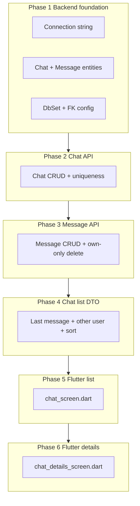

# Chats Exam (13-07-26) — Student-Style Phased Plan

**Index:** `IB180079` (same as last exam)  
**Project:** [Workshops/2. 13-07-26 - Chats](Workshops/2.%2013-07-26%20-%20Chats)  
**Exam PDF:** [Ispitni zadaci/RSII_Zadatak_13072026.pdf](Ispitni%20zadaci/RSII_Zadatak_13072026.pdf)

Same mindset as Cards: copy existing stack, rename, add only the exam rules. No fancy join tables, no SignalR, no over-engineering.



---

## Design choices (keep it dumb/simple)

| Decision | Choice | Why |
|----------|--------|-----|
| Participants | `User1Id` + `User2Id` on `ChatIB180079` | Max 2 users — no join table |
| Current user on create | From JWT via `IAuthenticatedUserAccessor` (like ProductReview) | Exam: logged-in user + selected other user |
| Unique chat | Service check: same pair in either order → `ClinetException` | Exam rule |
| Message sender | Set from JWT, not from client body | Can't fake sender |
| Delete own only | Override `DeleteAsync` like ProductReview | Copy-paste pattern |
| Chat list | Custom response fields on GET | Other user + last message + sort |

**Best copy sources:**
- Entity/FK shape: [Asset.cs](Workshops/2.%2013-07-26%20-%20Chats/eCommerce/eCommerce.Services/Database/Asset.cs) + User FK from [ProductReview.cs](Workshops/2.%2013-07-26%20-%20Chats/eCommerce/eCommerce.Services/Database/ProductReview.cs)
- Empty CRUD shell: Asset controller/service/DTOs
- Auth insert/delete overrides: [ProductReviewService.cs](Workshops/2.%2013-07-26%20-%20Chats/eCommerce/eCommerce.Services/ProductReviewService.cs)
- Flutter screens: profile menu + existing list/detail patterns in mobile UI

---

## Phase 0 — Connection string (you / first minute)

Update [appsettings.Development.json](Workshops/2.%2013-07-26%20-%20Chats/eCommerce/eCommerce.WebAPI/appsettings.Development.json):

```json
"DefaultConnection": "Server=192.168.0.1\\Exams,1999;Database=IB180079;User Id=john;Password=doe2025;TrustServerCertificate=True;"
```

Do **not** use `TrustedConnection`. Default project for migrations = **`eCommerce.Services`**, startup = **`eCommerce.WebAPI`**.

Initial `Update-Database` first (seed: `customer1` / `Test123`), then after our entities: `Add-Migration chats` + `Update-Database` (you run manually like last time).

---

## Phase 1 — Entities + DbContext (backend foundation)

### `ChatIB180079` (copy Asset + two User FKs)

```csharp
public class ChatIB180079
{
    public int Id { get; set; }
    [Required][MaxLength(100)] public string Name { get; set; } = string.Empty;
    public DateTime CreatedAt { get; set; } = DateTime.UtcNow;
    public int User1Id { get; set; }
    public int User2Id { get; set; }
    [ForeignKey("User1Id")] public User User1 { get; set; } = null!;
    [ForeignKey("User2Id")] public User User2 { get; set; } = null!;
    public ICollection<ChatMessageIB180079> Messages { get; set; } = new List<ChatMessageIB180079>();
}
```

### `ChatMessageIB180079`

```csharp
public class ChatMessageIB180079
{
    public int Id { get; set; }
    public int ChatId { get; set; }
    public int SenderUserId { get; set; }
    [Required] public string Content { get; set; } = string.Empty;
    public DateTime CreatedAt { get; set; } = DateTime.UtcNow;
    [ForeignKey("ChatId")] public ChatIB180079 Chat { get; set; } = null!;
    [ForeignKey("SenderUserId")] public User Sender { get; set; } = null!;
}
```

**Wire:**
- `DbSet`s in [eCommerceDbContext.cs](Workshops/2.%2013-07-26%20-%20Chats/eCommerce/eCommerce.Services/Database/eCommerceDbContext.cs)
- FK config in [eCommerceConfiguration.cs](Workshops/2.%2013-07-26%20-%20Chats/eCommerce/eCommerce.Services/Database/eCommerceConfiguration.cs) — copy Asset block; use `Restrict` or `NoAction` on User FKs to avoid SQL multiple-cascade paths; Cascade Chat → Messages

---

## Phase 2 — Chat API (create + list scaffolding)

Copy Asset stack → rename to `ChatIB180079`:

| Layer | Files |
|-------|--------|
| DTOs | Insert (`Name`, `User2Id` only — User1 from JWT), Update (minimal / maybe unused), Response, Search (`OtherUserId?`) |
| Validators | Name required / not whitespace; User2Id > 0; User2Id != current user (service check) |
| Service/Interface | `BaseCRUDService` + `IAuthenticatedUserAccessor` |
| Controller | Empty `BaseCRUDController` shell like Assets |
| Program.cs | Mapster + 3 scoped registrations |

**Custom Insert (copy ProductReview Insert style):**
1. `userId = _userAccessor.GetUserId()`
2. Validate name not empty/whitespace
3. Reject if `User2Id == userId`
4. Reject if chat already exists for pair in either order → `ClinetException("Razgovor već postoji.")`
5. Save with `User1Id = userId`, `User2Id = request.User2Id`

**GetAll filter:** only chats where `User1Id == me || User2Id == me`; optional filter by other user id.

---

## Phase 3 — Message API (send + delete own)

Copy Asset → `ChatMessageIB180079`:

| Insert request | `ChatId`, `Content` (sender from JWT) |
| Response | `Id`, `ChatId`, `SenderUserId`, `Content`, `CreatedAt` |
| Search | `ChatId` |

**Validators:** Content `NotEmpty` + `Must(s => !string.IsNullOrWhiteSpace(s))`

**Insert override:**
1. Current user from JWT
2. Load chat; fail if user not User1/User2 → `ClinetException`
3. Save message with `SenderUserId = me`, trim content

**Delete override (copy ProductReview Delete):**
- Only if `SenderUserId == me`, else not found / client error

Controller: `[Authorize]` like ProductReviews if that controller uses it.

---

## Phase 4 — Chat list response (exam “učitavanje razgovora”)

Extend `ChatIB180079Response` (or keep one response used by GetAll):

```csharp
public int Id { get; set; }
public string Name { get; set; }
public DateTime CreatedAt { get; set; }
public int OtherUserId { get; set; }
public string OtherUserFirstName { get; set; }
public string OtherUserLastName { get; set; }
public string? LastMessageContent { get; set; }  // null → Flutter shows "Nema poruka"
public DateTime? LastMessageCreatedAt { get; set; }
```

**Override GetAll / mapping in ChatService:**
1. Filter to current user’s chats (+ optional other user)
2. Include Users + Messages (or query last message)
3. Fill OtherUser = the participant who is not me
4. Last message = newest by `CreatedAt`
5. Sort: last message date desc; if no messages, use `CreatedAt` desc

This is the only non-trivial backend piece — still one service file, no extra microservices.

---

## Phase 5 — Flutter `chat_screen.dart`

**Copy patterns from:** [profile_screen.dart](Workshops/2.%2013-07-26%20-%20Chats/eCommerce/UI/ecommerce_mobile/lib/screens/profile_screen.dart) menu + existing list screens / providers (`BaseProvider`).

**New files:**
- `models/chat_ib180079.dart` (+ `.g.dart` if project uses codegen)
- `providers/chat_ib180079_provider.dart` → `super("ChatIB180079")`
- `screens/chat_screen.dart`

**Wire:**
- Profile menu: button **„Poruke“** → navigate to `ChatScreen`
- `main.dart`: register provider

**UI (one form, keep simple):**
1. TextField: chat name (required)
2. Dropdown/list of users **excluding** current user (`AuthProvider` id)
3. Selected user also **filters** chat list; if none selected → all my chats
4. Button **„Kreiraj razgovor“** → insert; on “already exists” show alert (API message)
5. List below: name, other user name, created date, last message or **„Nema poruka“**
6. Tap row → `ChatDetailsScreen(chatId: ...)`

---

## Phase 6 — Flutter `chat_details_screen.dart`

**New files:**
- `models/chat_message_ib180079.dart`
- `providers/chat_message_ib180079_provider.dart` → `super("ChatMessageIB180079")`
- `screens/chat_details_screen.dart`

**UI:**
- Load messages by `chatId`
- My messages right, other left; show content + time
- Bottom: TextField + send (block empty/whitespace)
- After send: clear field + reload
- Delete icon **only** on own messages; after delete reload
- When popping back to chat list, refresh so last message updates

---

## Phase 7 — Exam cleanup (you)

- VS: Clean Solution on backend
- Flutter: `flutter clean`
- Zip folder named `IB180079` → FTP Upload/RSII

---

## What we will NOT do (avoid hassle)

- No SignalR / realtime
- No participant join table
- No update-message feature
- No desktop Flutter app work (exam says Flutter profile form → mobile)
- No seeding chats (create via UI/Swagger)

---

## Implementation order when you approve

1. Phase 1–4 backend (entities → Chat → Message → list DTO) then you migrate  
2. Stop and smoke-test with Swagger (`customer1` / `Test123`)  
3. Phase 5–6 Flutter  
4. You clean + zip

Same as Cards: implement backend first, then Flutter when you say go.